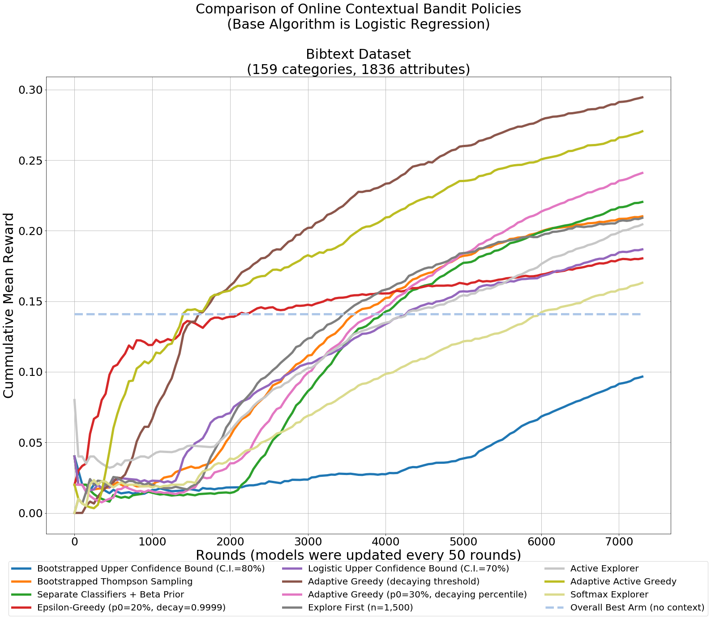
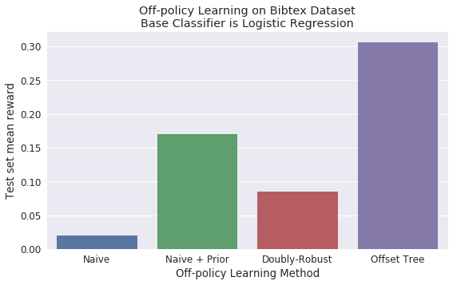

# Contextual Bandits


This Python package contains implementations of methods from different papers dealing with contextual bandit problems, as well as adaptations from typical multi-armed bandits strategies. It aims to provide an easy way to prototype and compare ideas, to reproduce research papers that don't provide easily-available implementations of their proposed algorithms, and to serve as a guide in learning about contextual bandits.

For details about the implementations, or if you would like to cite this in your research, see ["Adapting multi-armed bandits policies to contextual bandits scenarios"](https://arxiv.org/abs/1811.04383).


## Installation

Package is available on PyPI, can be installed with 

```pip install contextualbandits```


_Note: as of version 0.2.0, this package contains Cython code which needs to be compiled - meaning, it requires a C compiler and setting up Python's setuptools to use it. If for some reason the latest version fails to install in your setup, it's still possible to install an earlier version which was pure-python with `pip install contextualbandits==0.1.8.5` (also available in this GitHub page under branch `no_cython`)._


## Problem description

Contextual bandits, also known as multi-armed bandits with covariates or associative reinforcement learning, is a problem similar to multi-armed bandits, but with the difference that side information or covariates are available at each iteration and can be used to select an arm, whose rewards are also dependent on the covariates.

The problem comes from an iterative process generating data as follows:

* At each round, the world creates an observation consisting of a set of covariates (features) of fixed dimension, and a reward (which is stochastic but dependent on the covariates) for each arm/choice/label.
* An agent must choose an arm or label for the observation.
* The world reveals the reward for the arm chosen by the agent, but not for the other arms.

The aim is to create a policy that would maximize the rewards obtained by the agent. The arms might also expire over time and new arms might appear too, leading to the same exploration-exploitation dilemma faced in multi-armed bandits.

The problem is very similar to multi-class or multi-label classification (with the reward being whether the right label was chosen or not), but with the big difference that the right label or set of labels is not known for each observation, only whether the label that was chosen by the agent for each observation was correct or not.

While, in general, algorithms for the contextual bandits problem assume continuous rewards in the range `[0,1]`, **this package deals only with the case of discrete rewards `{0,1}`**, and only with the case of arms that all see the same covariates. Some methods might still work fine for continuous rewards, but they are not meant to be used with them.

Three of the main problematics that arise in contextual bandits are:

* Building a policy or strategy for making choices in an online setting that would manage exploration of new arms under different features, or exploitation of arms that are known to be good for some features - covered in `contextualbandits.online`.
* Building a policy/algorithm with data collected from a different policy, covered in `contextualbandits.offpolicy` (a.k.a. counter-factual risk minimization).
* Evaluating the performance of different strategies/policies/algorithms based on partially-labeled data, covered in `contextualbandits.evaluation`.

This package does not deal with other related topics such as:

* Incorporating social networks and similarity information between observations and/or arms - for some implementations of methods dealing with similarity information see [BanditLib](https://github.com/huazhengwang/BanditLib)
* Bandits with "expert advise" (e.g. Exp4, OnlineCover)
* Streaming clustering (used for defining similarity buckets)


For more information, see the user guides below.

Most of the algorithms here are meta-heuristics that take a binary classifier (such as Logistic Regression or XGBoost) as a black-box oracle.


## Getting started

You can find detailed usage examples with public datasets in the following IPython notebooks:

* [Online Contextual Bandits](http://nbviewer.jupyter.org/github/david-cortes/contextualbandits/blob/master/example/online_contextual_bandits.ipynb)
* [Off-policy Learning in Contextual Bandits](http://nbviewer.jupyter.org/github/david-cortes/contextualbandits/blob/master/example/offpolicy_learning.ipynb)
* [Policy Evaluation in Contextual Bandits](http://nbviewer.jupyter.org/github/david-cortes/contextualbandits/blob/master/example/policy_evaluation.ipynb)


## Documentation

Package documentation is available in readthedocs:
[http://contextual-bandits.readthedocs.io](http://contextual-bandits.readthedocs.io)

Documentation is also internally available through docstrings (e.g. you can try `help(contextualbandits.online.BootstrappedUCB)`, `help(contextualbandits.online.BootstrappedUCB.fit)`, etc.).

## Recent additions

* Added functionality for ranking top-N arms instead of always picking the single best one.
* Added tree-based partitioned UCB and TS.
* Added new online method `ParametricTS`.
* Added option for `ExploreFirst` to make choices using active learning.
* Updated the online example notebook for better results with both full-refit and streaming-mode versions after the latest additions.
* Added a `random_state` parameter to the methods for getting reproducible results.
* Added option to use base classifier's `warm_start` if available (for faster model fitting).
* Added functionality for `refit_buffer` in the batch/streaming train mode (see docs for details).
* Added a linear regression class which keeps the matrices used for the closed-form solution, so that it can be fit incrementally while giving the same solution as if fitted to all data at once.
* LinUCB speed has been improved by taking more efficient matrix operation routes and using Cython code.


## Implemented algorithms

Methods in this package include:
 
Online linear models:
* LinUCB (see [2] and [11]) 
* Linear Thompson Sampling (see [4])
* Logistic UCB and Thompson sampling (see [1])

Adaptations from multi-armed bandits taking arbitrary classifiers:
* Upper Confidence Bound (see [1], [6] and [3])
* Thompson Sampling (see [1] and [3])
* Epsilon Greedy (see [1], [7] and [6])
* Adaptive Greedy (see [1] and [5])
* Explore-Then-Exploit (see [1])

Other:
* Exploration based on active learning (see [1])
* SoftMax chooser (see [1]).
* Tree-based MAB partitioners (see [14]).

Off-policy:
* Offset Tree (see [8])
* Doubly-Robust Policy Optimization (see [10])

Evaluation:
* Rejection Sampling (see [2])
* Doubly-Robust Policy Evaluation (see [9])
* NCIS (see [13])

Most of the methods here can work with streaming data by fitting them to the data in batches if the base classifier has a `partial_fit` method. They otherwise require to be refit to all the historic data every time they are updated. In batch training mode, methods based on bootstrapping approximate resamples either through setting random weights or through including each observation a number of times ~ Poisson(1) (see documentation for details).

Also included is a linear regression class (`contextualbandits.linreg.LinearRegression`) which keeps the matrices used for the closed-form solution and updates them incrementally when calling `partial_fit` - the advantage being that fitting it in batches leads to the same result as fitting it to all data - in order to go along with the batch/streaming methods from `contextualbandits.online`.





## Serializing (pickling) objects

Using `pickle` to serialize objects from this library is likely to fail. Use `dill` instead, which has the same syntax as pickle, e.g.:
```python
import dill
from sklearn.linear_model import SGDClassifier
from contextualbandits.online import BootstrappedUCB

m = BootstrappedUCB(SGDClassifier(loss="log"), nchoices = 5, batch_train = True)
dill.dump(m, open("saved_ucb_model.dill", "wb"))
m = dill.load(open("saved_ucb_model.dill", "rb"))
```

## Some comments

Many of the algorithms here oftentimes don't manage to beat simpler benchmarks (e.g. Offset Tree vs. a naïve One-Vs-Rest using only subsets of the data for each classifier), and I wouldn't recommend relying on them. They are nevertheless provided for comparison purposes.

If in doubt of where to start or which method to choose, `BootstrappedUCB` is the safest bet for online methods, and `OffsetTree` is the safest bet for off-policy methods, when considering using methods without tuning any hyperparameters.

Many of this package's methods assume that the binary classification algorithms used have probabilistic outputs (e.g. `DoublyRobustEstimator`), ideally with a `predict_proba` method, or with a `decision_function` method to which it will apply a sigmoid transformation (otherwise will assume the outputs from `predict` are bounded between zero and one). Under some of the online algorithms (e.g. `SoftmaxExplorer`, `AdaptiveGreedy`) or if using smoothing, this will not work very well with e.g. SVM, in which case you'll need to programmatically define a new class that performs a recalibration within its `fit` method, and outputs the calibrated numbers through its `predict_proba` (see reference [12]).

Be aware that this is a research-oriented package, and is meant to provide flexibility at the expense of speed.

## References

* [1] Cortes, D. (2018). Adapting multi-armed bandits policies to contextual bandits scenarios. arXiv preprint arXiv:1811.04383.

* [2] Li, L., Chu, W., Langford, J., & Schapire, R. E. (2010, April). A contextual-bandit approach to personalized news article recommendation. In Proceedings of the 19th international conference on World wide web (pp. 661-670). ACM.

* [3] Chapelle, O., & Li, L. (2011). An empirical evaluation of thompson sampling. In Advances in neural information processing systems (pp. 2249-2257).

* [4] Agrawal, S., & Goyal, N. (2013, February). Thompson sampling for contextual bandits with linear payoffs. In International Conference on Machine Learning (pp. 127-135).

* [5] Chakrabarti, D., Kumar, R., Radlinski, F., & Upfal, E. (2009). Mortal multi-armed bandits. In Advances in neural information processing systems (pp. 273-280).

* [6] Vermorel, J., & Mohri, M. (2005, October). Multi-armed bandit algorithms and empirical evaluation. In European conference on machine learning (pp. 437-448). Springer, Berlin, Heidelberg.

* [7] Yue, Y., Broder, J., Kleinberg, R., & Joachims, T. (2012). The k-armed dueling bandits problem. Journal of Computer and System Sciences, 78(5), 1538-1556.

* [8] Beygelzimer, A., & Langford, J. (2009, June). The offset tree for learning with partial labels. In Proceedings of the 15th ACM SIGKDD international conference on Knowledge discovery and data mining (pp. 129-138). ACM.

* [9] Dudík, M., Langford, J., & Li, L. (2011). Doubly robust policy evaluation and learning. arXiv preprint arXiv:1103.4601.

* [10] Dudík, M., Erhan, D., Langford, J., & Li, L. (2014). Doubly robust policy evaluation and optimization. Statistical Science, 485-511.

* [11] Chu, W., Li, L., Reyzin, L., & Schapire, R. (2011, June). Contextual bandits with linear payoff functions. In Proceedings of the Fourteenth International Conference on Artificial Intelligence and Statistics (pp. 208-214).

* [12] Kuhn, M., & Johnson, K. (2013). Applied predictive modeling (Vol. 26). New York: Springer.

* [13] Gilotte, A., Calauzènes, C., Nedelec, T., Abraham, A., & Dollé, S. (2018, February). Offline a/b testing for recommender systems. In Proceedings of the Eleventh ACM International Conference on Web Search and Data Mining (pp. 198-206).

* [14] Elmachtoub, A. N., McNellis, R., Oh, S., & Petrik, M. (2017). A practical method for solving contextual bandit problems using decision trees. arXiv preprint arXiv:1706.04687.
